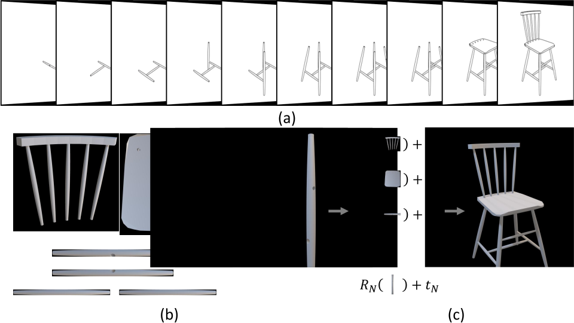
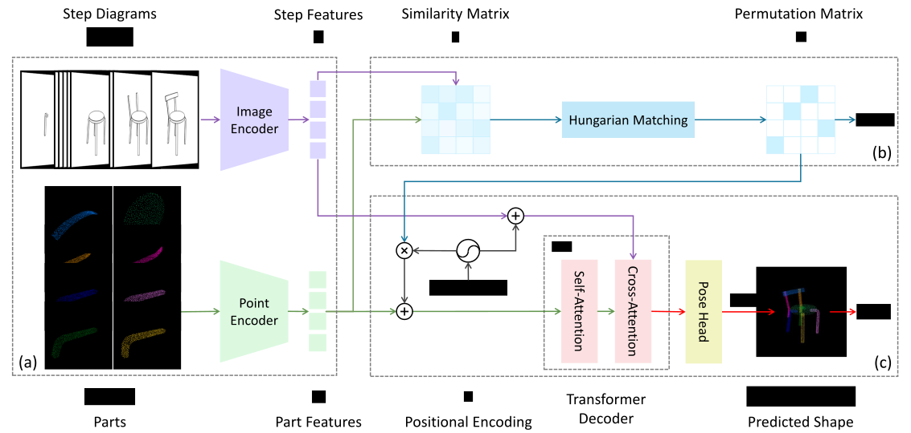

<div align="center">
  <h1>Manual-PA: Learning 3D Part Assembly from Instruction Diagrams</h1>
  <div>
    <a href='https://academic.davidz.cn' target='_blank'>Jiahao Zhang<sup>1</sup></a>;
    <a href='https://users.cecs.anu.edu.au/~cherian' target='_blank'>Anoop Cherian<sup>2</sup></a>;
    <a href='https://crodriguezo.me' target='_blank'>Cristian Rodriguez<sup>3</sup></a>;
    <a href='https://weijiandeng.xyz' target='_blank'>Weijian Deng<sup>1</sup></a>;
    <a href='https://users.cecs.anu.edu.au/~sgould' target='_blank'>Stephen Gould<sup>1</sup></a>
  </div>
  <sup>1</sup>The Australian National University
  <sup>2</sup>Mitsubishi Electric Research Labs
  <sup>3</sup>The Australian Institute for Machine Learning
  <br>
  <br>
  <div>
    <a href='https://arxiv.org/abs/2411.18011' target='_blank'></a>
    <a href="https://github.com/DavidZhang73/pytorch-lightning-template"></a>
    <a href="LICENSE"></a>
  </div>
  <br>

https://github.com/user-attachments/assets/aa05559a-9348-469c-8167-70a03037de63

</div>

## Abstract



Assembling furniture amounts to solving the discrete-continuous optimization task of selecting the furniture parts to assemble and estimating their connecting poses in a physically realistic manner. The problem is hampered by its combinatorially large yet sparse solution space thus making learning to assemble a challenging task for current machine learning models. In this paper, we attempt to solve this task by leveraging the assembly instructions provided in diagrammatic manuals that typically accompany the furniture parts. Our key insight is to use the cues in these diagrams to split the problem into discrete and continuous phases. Specifically, we present Manual-PA, a transformer-based instruction Manual-guided 3D Part Assembly framework that learns to semantically align 3D parts with their illustrations in the manuals using a contrastive learning backbone towards predicting the assembly order and infers the 6D pose of each part via relating it to the final furniture depicted in the manual. To validate the efficacy of our method, we conduct experiments on the benchmark PartNet dataset. Our results show that using the diagrams and the order of the parts lead to significant improvements in assembly performance against the state of the art. Further, Manual-PA demonstrates strong generalization to real-world IKEA furniture assembly on the IKEA-Manual dataset.

## Method



## Prerequisites

### Installation

```bash
# clone project
git clone git@github.com:DavidZhang73/Manual-PA.git

# create conda virtual environment
conda create -n ManualPA python=3.12
conda activate ManualPA

# install PyTorch
conda install pytorch==2.4.0 torchvision==0.19.0 pytorch-cuda==12.1 -c pytorch -c nvidia

# install PyTorch3D
conda install pytorch3d iopath -c pytorch3d -c iopath

# install pytorch_scatter
pip install torch-scatter -f https://data.pyg.org/whl/torch-2.4.0+cu121.html

# install other requirements
pip install -r requirements.txt
```

### Data Preparation

```bash
mkdir data/ikea-manual-assembly
huggingface-cli download --repo-type dataset DavidZhang73/ManualPADatasets --local-dir data/ikea-manual-assembly
cd data/ikea-manual-assembly
unzip ikea-manual.zip
unzip partnet.zip
```

### Training Stage 1: Permutation Learning

**Train on all categories**

```bash
python src/main.py fit -c configs/data/partnet_synthetic_stepwise.yaml -c configs/model/manual_pa_order.yaml --trainer.logger.name ManualPA_Order
```

**Inference for all categories**

```bash
python src/main.py test -c configs/data/partnet_synthetic_stepwise.yaml -c configs/model/manual_pa_order.yaml --trainer.logger.name ManualPA_Order_Test --ckpt_path logs/IkeaManualAssembly/<run_id>/checkpoints/<best>.ckpt
```

### Training Stage 2: Part Pose Estimation

**Train on Chair**

```bash
python src/main.py fit -c configs/data/partnet_synthetic_stepwise_chair.yaml -c configs/model/manual_pa.yaml --trainer.logger.name ManualPA_Chair --data.order_pathname logs/IkeaManualAssembly/<run_id>/pred_orders.json
```

**Train on Table**

```bash
python src/main.py fit -c configs/data/partnet_synthetic_stepwise_table.yaml -c configs/model/manual_pa.yaml --trainer.logger.name ManualPA_Table --data.order_pathname logs/IkeaManualAssembly/<run_id>/pred_orders.json
```

## Citation

```
@inproceedings{Zhang2024Manual,
  author    = {Zhang, Jiahao and Cherian, Anoop and Rodriguez, Cristian and Deng, Weijian and Gould, Stephen},
  title     = {Manual-PA: Learning 3D Part Assembly from Instruction Diagrams},
  booktitle = {arXiv preprint arXiv:2407.12066},
  year      = {2024},
}
```
